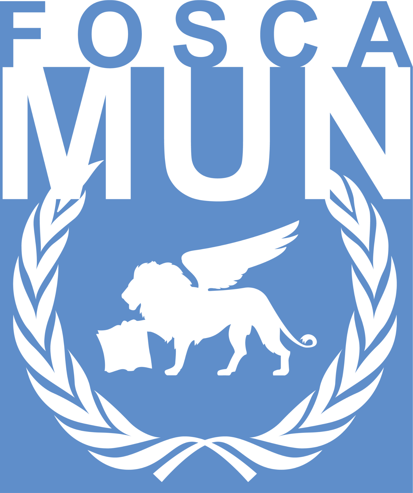
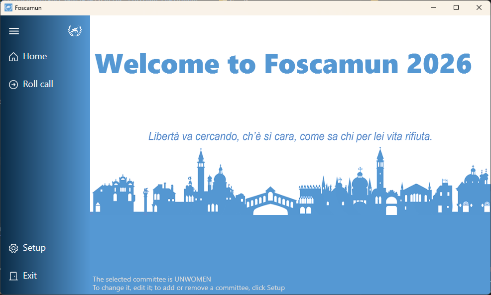
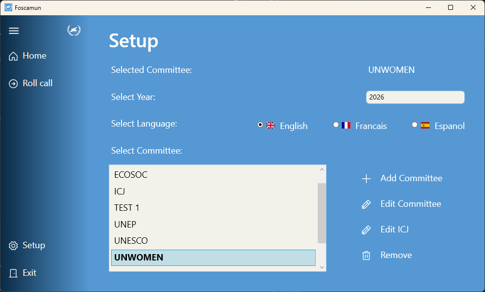
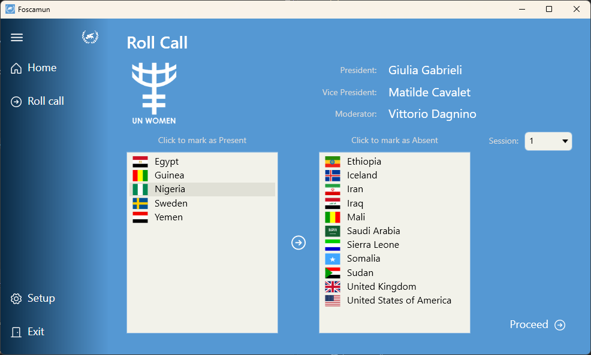
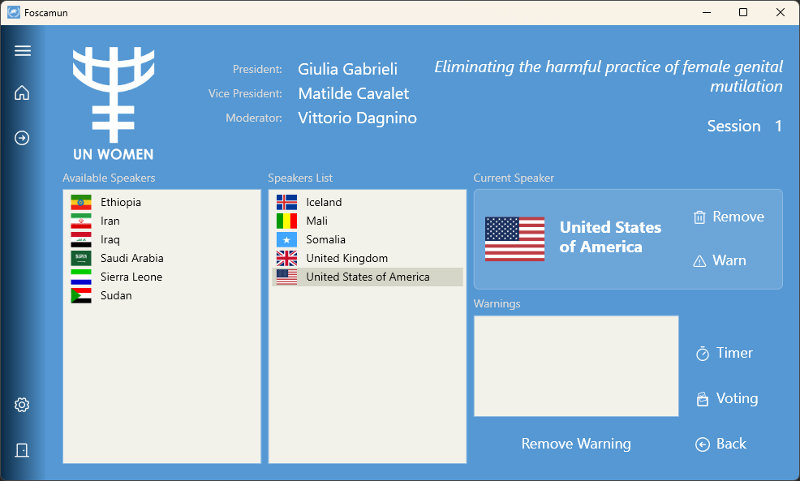
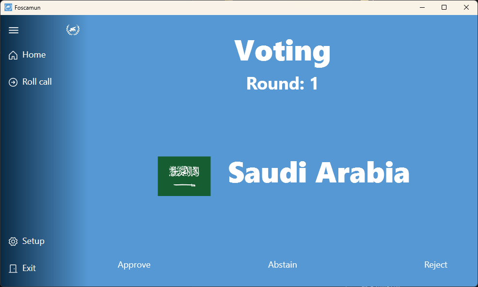

# 🌍 Foscamun - MUN Conference Management System

[](https://dotnet.microsoft.com/download/dotnet/10.0)
[](https://github.com/nanedb/Foscamun2026)
[](LICENSE)
[](https://github.com/nanedb/Foscamun2026/releases)

A modern, feature-rich desktop application for managing Model United Nations (MUN) conferences. Built with WPF and .NET 10, Foscamun streamlines committee sessions, roll calls, speaker management, and voting processes.



---

## ✨ Features

### 🏛️ Committee Management
- Create and manage multiple committees
- Assign president, vice-president, and moderator roles
- Manage participating countries
- Configure topics and sessions
- Customizable committee logos

### 📋 Roll Call System
- Quick roll call for delegates
- Mark present/absent countries
- Visual country management
- Automatic attendance tracking

### 🎤 Session Management
- Dynamic speakers list
- Real-time speaker queue management
- Current speaker display
- Add/remove speakers on the fly
- Warning system for delegates

### ⏱️ Integrated Timer
- Customizable speaking time limits
- Visual countdown
- Audio notifications
- Pause and reset functionality

### 🗳️ Voting System
- Support for approval, abstention, and rejection
- Multiple voting rounds
- Real-time vote tallying
- Comprehensive final results
- Automatic motion outcome determination

### ⚖️ ICJ (International Court of Justice) Support
- Dedicated ICJ management
- Judge and vice-judge assignments
- Advocate and juror tracking
- Specialized voting procedures

### 🌐 Multi-Language Support
- English
- French (Français)
- Spanish (Español)
- Easy language switching without restart

### 💾 Data Persistence
- SQLite database for reliable data storage
- Automatic database creation
- Settings persistence
- Data backup and restore capabilities

---

## 🖥️ Screenshots








---

## 📥 Installation

### Option 1: Download Pre-Built Release (Recommended)

1. Go to [Releases](https://github.com/nanedb/Foscamun2026/releases)
2. Download the appropriate version for your system:
   - `Foscamun-win-x64-v1.0.0.zip` - Windows 64-bit (most common)
   - `Foscamun-win-x86-v1.0.0.zip` - Windows 32-bit
   - `Foscamun-win-arm64-v1.0.0.zip` - Windows ARM64
3. Extract to a user folder (Desktop, Documents, etc.)
4. Run `Foscamun.exe`

✅ **No administrator privileges required**  
✅ **No .NET installation needed** - Self-contained  
✅ **Portable** - Can run from USB drive

### Option 2: Build from Source

**Prerequisites:**
- [.NET 10 SDK](https://dotnet.microsoft.com/download/dotnet/10.0)
- Visual Studio 2025+ or Visual Studio Code

**Steps:**
```bash
# Clone the repository
git clone https://github.com/nanedb/Foscamun2026.git
cd Foscamun2026

# Restore dependencies
dotnet restore

# Build
dotnet build -c Release

# Run
dotnet run
```

**Or build self-contained executable:**
```bash
dotnet publish -c Release -r win-x64 --self-contained true -p:PublishSingleFile=true
```

---

## 🚀 Quick Start

### First Launch

1. **Select Language**: Choose between English, French, or Spanish
2. **Set Year**: Enter the MUN conference year
3. **Create Committee**: Add your first committee with details
4. **Add Countries**: Assign participating countries to the committee

### Running a Session

1. **Roll Call**: Mark present delegates
2. **Start Session**: Begin the committee session
3. **Manage Speakers**: Add delegates to the speakers list
4. **Use Timer**: Track speaking time
5. **Voting**: Conduct votes when needed
6. **View Results**: See final voting outcomes

📖 For detailed instructions, see [USER_GUIDE.md](USER_GUIDE.md)

---

## 🛠️ Technology Stack

- **Framework**: .NET 10
- **UI**: WPF (Windows Presentation Foundation)
- **Architecture**: MVVM (Model-View-ViewModel)
- **Database**: SQLite with Dapper ORM
- **MVVM Toolkit**: CommunityToolkit.Mvvm
- **Vector Graphics**: SharpVectors for SVG rendering
- **DI Container**: Microsoft.Extensions.DependencyInjection

### Key Packages

| Package | Version | Purpose |
|---------|---------|---------|
| Microsoft.Data.Sqlite | 10.0.1 | Database access |
| Dapper | 2.1.66 | Micro ORM |
| CommunityToolkit.Mvvm | 8.4.0 | MVVM helpers |
| SharpVectors.Wpf | 1.8.5 | SVG rendering |
| Extended.Wpf.Toolkit | 5.0.0 | Additional WPF controls |

---

## 📁 Project Structure

```
Foscamun/
├── Data/                   # Database access layer
├── Models/                 # Data models
├── ViewModels/            # MVVM ViewModels
├── Views/                 # WPF Pages and Windows
├── Repositories/          # Data repositories
├── Helpers/               # Utility classes
├── Resources/             # Images, icons, logos, sounds
│   ├── CommitteeLogo/    # Committee SVG logos
│   ├── Icons/            # Application icons
│   ├── flags/            # Country flags
│   └── Sounds/           # Audio files
├── Strings/               # Language resource dictionaries
├── Styles/                # WPF styles and themes
├── Fonts/                 # Custom fonts
└── Foscamun.db           # SQLite database (auto-generated)
```

---

## 🎨 Customization

### Committee Logos

Add custom committee logos by placing SVG files in `Resources\CommitteeLogo\`:

1. Create an SVG file named after your committee (e.g., `ECOSOC.svg`)
2. Place it in the `Resources\CommitteeLogo\` folder
3. Restart the application

If no custom logo exists, `Generic.svg` is used as fallback.

### Language Resources

Language files are located in `Strings\`:
- `Strings.en.xaml` - English
- `Strings.fr.xaml` - French
- `Strings.es.xaml` - Spanish

To add a new language, create a new resource dictionary following the same pattern.

---

## 🧪 Building and Testing

### Build for Development

```bash
dotnet build
```

### Run Tests

```bash
dotnet test
```

### Build Release

```bash
dotnet build -c Release
```

### Create Deployment Package

Use the provided scripts:

**PowerShell** (all platforms):
```powershell
.\publish.ps1 -Version "1.0.0"
```

**Batch** (Windows x64 only):
```cmd
publish-quick.bat
```

📖 See [DEPLOYMENT.md](DEPLOYMENT.md) for detailed deployment instructions.

---

## 📚 Documentation

- [USER_GUIDE.md](USER_GUIDE.md) - Complete user guide
- [DEPLOYMENT.md](DEPLOYMENT.md) - Deployment and build guide
- [DEPLOYMENT_CHECKLIST.md](DEPLOYMENT_CHECKLIST.md) - Release checklist

---

## 🤝 Contributing

Contributions are welcome! Here's how you can help:

1. **Fork** the repository
2. **Create** a feature branch (`git checkout -b feature/AmazingFeature`)
3. **Commit** your changes (`git commit -m 'Add some AmazingFeature'`)
4. **Push** to the branch (`git push origin feature/AmazingFeature`)
5. **Open** a Pull Request

### Development Guidelines

- Follow existing code style and conventions
- Write clear commit messages
- Test thoroughly before submitting
- Update documentation as needed
- Add comments for complex logic

---

## 🐛 Bug Reports and Feature Requests

Found a bug or have a feature request? Please use GitHub Issues:

- [Report a Bug](https://github.com/nanedb/Foscamun2026/issues/new?labels=bug)
- [Request a Feature](https://github.com/nanedb/Foscamun2026/issues/new?labels=enhancement)
- [Ask a Question](https://github.com/nanedb/Foscamun2026/discussions)

---

## 📄 License

This project is licensed under the MIT License - see the [LICENSE](LICENSE) file for details.

---

## 👥 Authors and Acknowledgments

- **Developer**: [nanedb](https://github.com/nanedb)
- **Repository**: [Foscamun2026](https://github.com/nanedb/Foscamun2026)

Special thanks to all contributors and the MUN community for their support and feedback.

---

## 🌟 Star History

If you find this project useful, please consider giving it a star ⭐!

---

## 📞 Support

- **Issues**: https://github.com/nanedb/Foscamun2026/issues
- **Discussions**: https://github.com/nanedb/Foscamun2026/discussions
- **Documentation**: See the `docs/` folder

---

## 🔄 Version History

### v1.0.0 (2026-03-01)
- Initial release
- Complete MUN management system
- ICJ support
- Multi-language support
- Voting system with multiple rounds
- See [RELEASE_NOTES](RELEASE_NOTES_TEMPLATE.md) for full details

---

## 🚦 Status

- ✅ Stable Release
- ✅ Production Ready
- ✅ Actively Maintained

---

<div align="center">

**Made with ❤️ for the MUN Community**

[Download Latest Release](https://github.com/nanedb/Foscamun2026/releases/latest) | [View Documentation](USER_GUIDE.md) | [Report Issue](https://github.com/nanedb/Foscamun2026/issues)

</div>
